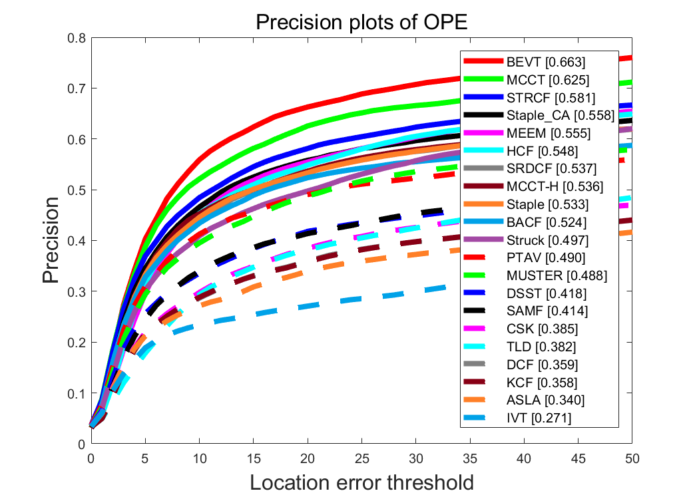
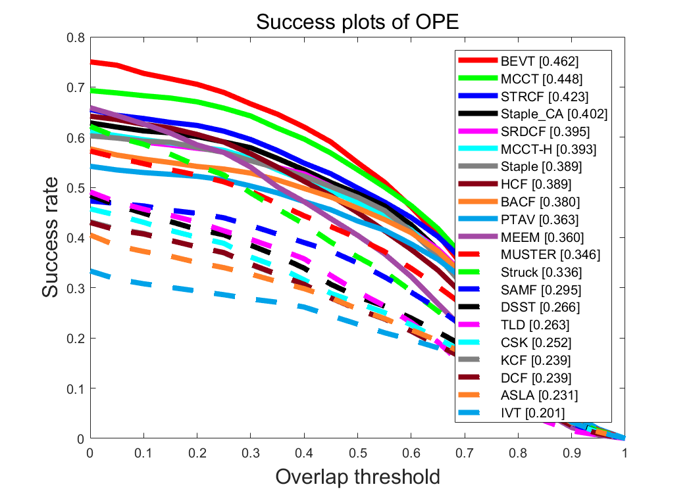

# BEVT-tracker
| **Test passed**                                              |
| ------------------------------------------------------------ |
| [](https://www.mathworks.com/products/matlab.html) [](http://www.vlfeat.org/matconvnet/download/matconvnet-1.0-beta25.tar.gz)  |

> Matlab implementation of Boundary Effect-Aware Visual Tracking for UAV with Online Enhanced Background Learning and Multi-Frame Consensus Verification (BEVT tracker).

## Instructions
1. Download VGG-Net-19 by cliking [here](http://www.vlfeat.org/matconvnet/models/imagenet-vgg-verydeep-19.mat) and put it in `/model`.
2. Download matconvnet toolbox [here](http://www.vlfeat.org/matconvnet/download/matconvnet-1.0-beta25.tar.gz) and put it in `/external`.
3. Configure the data sequence in `configSeqs.m`.
4. Run `BEVT_Demo_single_seq.m`

Note: the original version is using CPU to run the whole program. 
If GPU version is required, just change `false` in the following lines in `run_BEVT.m` to `true`:
```matlab
global enableGPU;
enableGPU = false;

vl_setupnn();
vl_compilenn('enableGpu', false);
```

## Acknowledgements
The parameter settings are partly borrowed from [BACF](http://www.hamedkiani.com/bacf.html) and [SRDCF](https://www.cvl.isy.liu.se/research/objrec/visualtracking/decontrack/index.html) paper and convolutional feature extraction function is borrowed from [HCF](https://github.com/jbhuang0604/CF2).

## Results



